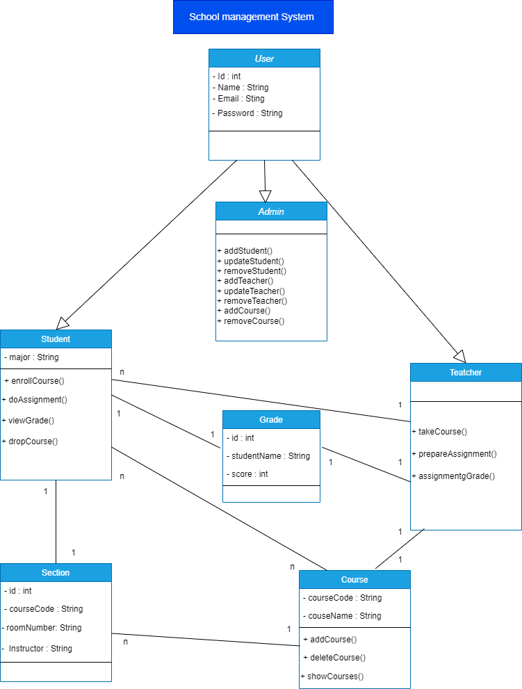

# School Management System

## Description of the Project

The School Management System is a comprehensive software solution designed to streamline and improve the administration of educational institutions. It provides a range of features for managing users, students, teachers, sections, courses, and grading. making it easier for schools to maintain organized and efficient operations.

## Class Diagram


## Setup
1- Clone the repository to your local machine.

2- Install the necessary dependencies.

3- Set up your MySQL database and update the application.properties file with your database credentials:

 ```
   spring.datasource.url=jdbc:mysql://localhost:3306/firstProject
    spring.datasource.username=root
    spring.datasource.password=Waleed3637639382
    spring.datasource.driver-class-name=com.mysql.cj.jdbc.Driver

    spring.jpa.hibernate.ddl-auto=update

    spring.jpa.show-sql=true

    server.error.include-stacktrace=never

   ```

4- Run the application

## Technologies Used
- IntelliJ IDEA: As the integrated development environment (IDE).
- Spring Web: For creating the web application.
- MySQL Workbench: For managing the database.
- Postman: For testing the API endpoints.

  
## Controllers and Routes structure
### Users

- `GET /users`: Retrieve a list of all users.
- `POST /users/add`: Add new movies.
- `DELETE /users/delete/{id}`: Delete a user by their name. 
- `PUT /users/update/{id}`: Update a user's details. The request body should include the updated user details in JSON format.
### Admin

- `GET /admins`: Retrieve a list of all admins.
- `POST /admins/add`: Add new admins.
- `DELETE /admin/delete/{id}`: Delete the admin by its id.
- `PUT /admins/update/{id}`: Update the admin's details. The request body should include the updated admins details in JSON format.
  
### Student

- `GET /Student`: Retrieve a list of all Student.
- `POST /Student/add`: Add a new Students. 
- `DELETE /Student/delete/{id}`: Delete a Student by its id. 
- `PUT /Student/update/{id}`: Update a Students details. The request body should include the updated Student details in JSON format.
- 
### Teacher

- `GET /teachers`: Retrieve a list of all teachers.
- `POST /teachers/add`: Add a new teachers. 
- `DELETE /teacher/delete/{id}`: Delete a teachers by its ID.
- `PUT /teacher/update/{id}`: Update a teachers details. The request body should include the updated teacher details in JSON format.

  ### Course

- `GET /Courses`: Retrieve a list of all Course.
- `POST /Courses/add`: Add a new Course. 
- `DELETE /Courses/delete/{id}`: Delete a Course by its ID.
- `PUT /Courses/update/{id}`: Update a Course details. The request body should include the updated Course details in JSON format.

  ### Section

- `GET /Section`: Retrieve a list of all Section.
- `POST /Section/add`: Add a new Section. 
- `DELETE /Section/delete/{id}`: Delete a Section by its ID.
- `PUT /Section/update/{id}`: Update a Section details. The request body should include the updated Section details in JSON format.

  ### Grade

- `GET /grades`: Retrieve a list of all Grade.
- `POST /grade/add`: Add a new Grade. 
- `DELETE /grade/delete/{id}`: Delete a Grade by its ID.
- `PUT /grade/update/{id}`: Update a Grade details. The request body should include the updated Grade details in JSON format.
  


## Extra links(Trello, Presentation Slides)
- [Trello_link](https://trello.com/b/CeJ4kIVt/my-first-project)
- [Presentation_slides](https://slides.com/d/VJ9sFeY/live)

## Future Work
In the future, I want to do:  
- Do the sucrttiy
- Do the frontend development
  

## Resources
- [Ironhack](https://my.ironhack.com/)
- [Baeldung Jackson Annotations Guide](https://www.baeldung.com/jackson-annotations)
- [Query Methods](https://docs.spring.io/spring-data/jpa/docs/current/reference/html/#jpa.query-methods)
- [Stack OverFlow](https://stackoverflow.com/questions/38403740/authenticate-only-selected-rest-end-points-spring-boot)
